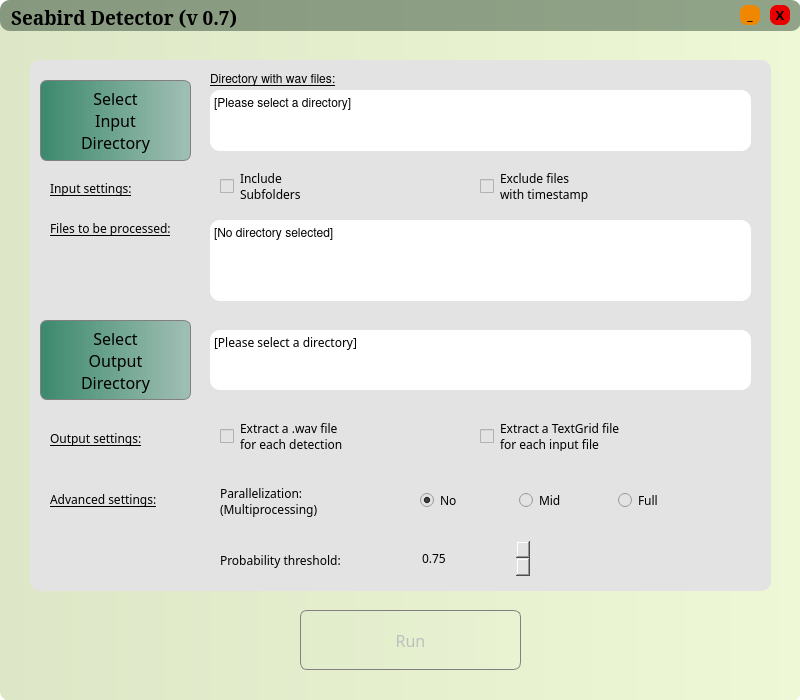

# Seabirds Detection

<!--- 
Todo:
1. Maybe change name
2. Add description
3. Mention [konpsar](https://github.com/konpsar) as contributor
4. Maybe add license
--->
This algorithm is a DNN classifier specialized in the acoustic detection of Scopoli’s and Yelkouan shearwater calls. The user can interact with this tool through a Graphical User Interface that runs in python. The classifier is based on the pre-trained weights and architecture of the YAMNet network and an annotated dataset of shearwater calls from Malta and Croatia. The duration of stereo audio content in hours used for training the DNN model: 

| Origin | Scopoli| Yelkouan | Noise |
|----------|----------|----------|---------|
| Malta    | 1.79    | 1.76    | 8.12    |
| Croatia    | 0.84   | 0.75    | 3.50    |
| External    | 0.00    | 0.00    | 4.97    |
| **Total**  | **2.63** | **2.51** | **16.60**  |


## Installation

1. Create a new `python 3.8` environment.

2. Install required packages. 

    ```bash
    pip install -r src/requirements.txt
    ```

## Running the Tool

1. Activate python environment.

2. Execute `seabirds_gui.py` file.

    ```bash
    python3 gui.py
    ```



### Configurations/Directories/Settings

All available settings are shown on the first page of the GUI.

#### Mandatory Settings

- **Input Directory**

  Click "Select Input Directory" button and navigate to the folder that contains the wav files for the analysis. When a folder with wav files is selected, the wav files that are going to go through the analysis are shown in the “Files to be processed” text box.

- **Output Directory**

#### Optional Settings 
<!-- Change here!!!! -->
- **Extract detected segments** 

  Option to export the wav files of the segments that were detected during the  detection and classification procedure. If we want to extract them, we just check the corresponding checkbox.

- **Separate raven .txt file for each .wav** 

  Option to export the raven compatible results files one per file, instead of one per analysis. If we want to extract one raven compatible .txt and .xlsx per input recording, then we can just check the corresponding checkbox. 

- **Parallelization**

This setting affect the number of CPUs that are used. "No" limits computation to only 1 core. "Mid" will use half the  cores and "Full"" will attempt to use all the available cores.

- **Probability threshold**

Classifier's probability threshold has an important effect on the detection performance. After detection, each event is given a probability of being a respective shearwater species call. If the probability of an event is greater or equal to this threshold then the event will be considered a shearwater call in the respective species class (Scopoli’s or Yelkouan shearwater). For example, if we want to set a probability threshold equal to 0.3, we can type 0.3 or change the spinbox value through the up/down buttons. This parameter can take values from 0.01 to 0.99. By default, a probability threshold equal to 0.5 will be used. On an annotated test set (22 5-min recordings, half with noise class and half with shearwater classes), the following true and false detection rates (TDR and FDR) were obtained at the three different thresholds of _p_ = 0.5, _p_ = 0.6 and _p_ = 0.75: 

| Detection rate | _p_ = 0.5| _p_ = 0.6 | _p_ = 0.75 |
|----------|----------|----------|---------|
| Scopoli (TDR) | 94.0%   | 90.5%    | 88.7%    |
| Yelkouan (TDR) | 64.8%  | 58.1%    | 53.2%    |
| FDR | 1.60%  | 0.66%    | 0.45%    |
| Yelkouan identified as Scopoli | 5.5% | 3.4% | 2.6%  |
| Scopoli identified as Yelkouan | 4.1% | 2.6% | 1.5%  |

After selecting all the desired directories and parameters, RUN button will become available:

<!--  -->

By clicking run, next screen of the GUI will be shown, where you can initially see the parameters that will be used for the analysis, and when the procedure starts, you can follow the execution of the algorithm (by reading the log as execution proceeds), or Cancel it if desired.

<!--  -->

When the execution reaches the end (all input files have been processed), the results screen is shown, where you can see the raven compatible detections table that is also exported in the output/results folder.

<!--  -->

### Results

In the corresponding output folder, you can find:

- **`detections`**: A folder where some intermediate files of the analysis are saved, in order to skip the first part of the algorithm if the same files are analyzed again with a different probability threshold.

  - In case you have selected to also export wav audio files for each detection segment, a folder `extracted_segments` where all the segments that have been detected and classified as gunshots are saved in .wav format.

  - In case you haven’t selected to export separated Raven compatible files for each input recording:
    - `Results.txt`: Detections table compatible with Raven
    - `Results.xlsx`: Detections table in an Excel file format

  - In case you have selected to export separated Raven compatible files for each input recording, one more subfolder will be created with the title `separated_results`, where all the exported Raven compatible files will be extracted.

- **Analysis_report_XXXXXX_XXXXXX.txt**: A report of the analysis which contains all the important information about the parameters used, the files analyzed, and the exported files.


> ⚠️ Important note: In case you re-run the algorithm with the same input folder (e.g. with a different probability threshold), all previous exported segments will be deleted and only the new ones will be kept. The rest of the files won’t be deleted.
